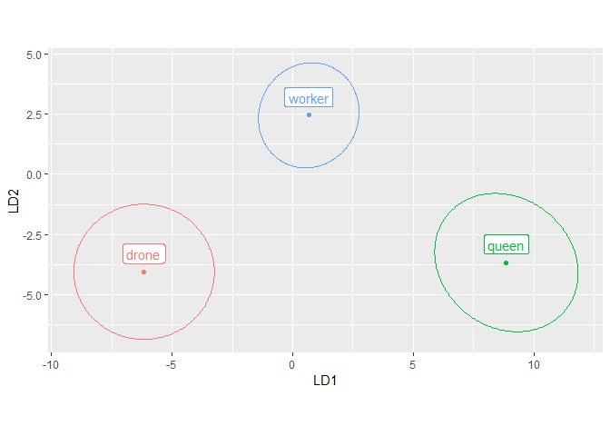
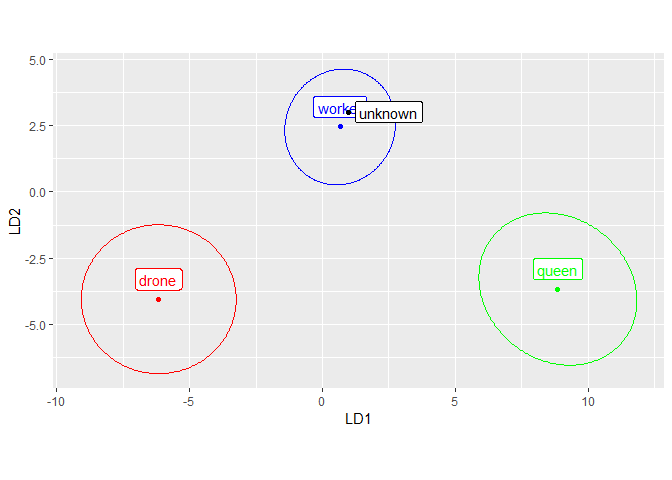
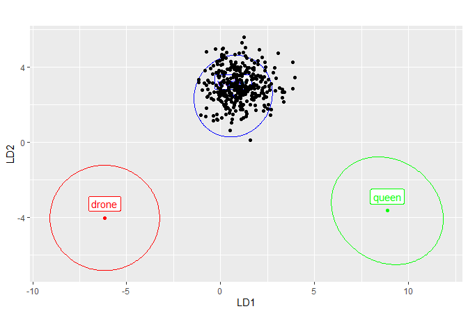
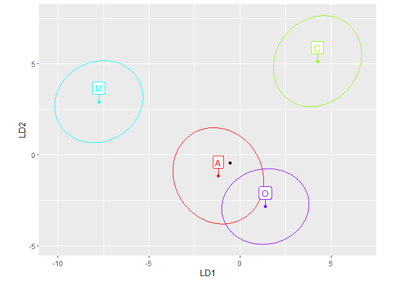

<!-- README.md is generated from README.Rmd. Please edit that file -->

# IdentiFlyR

<!-- badges: start -->
<!-- badges: end -->

IdentiFlyR can be used to store identification data in an XML file.
Later, the data can be read from the XML file and used to identify an
unknown sample. An alternative to this package could be to provide all
the raw data and use it for identification. For large datasets this may
be less convenient, slower and undesirable. Identification is based on
linear discriminant analysis (LDA), also known as canonical variate
analysis (CVA). The focus of this package is on using LDA to identify an
unknown sample, not on exploratory analysis.  
Currently IdentiFLyR only supports geometric morphometric data in two
dimensions. \## Installation

You can install the development version of IdentiFlyR from
[GitHub](https://github.com/DrawWing/IdentiFlyR) with:

``` r
# install.packages("devtools")
devtools::install_github("DrawWing/IdentiFlyR")
```

## Examples

Read identification data from XML file and plot means and confidence
ellipses in the first two linear discriminant functions. Identification
data consists of: reference, means, covariances and coefficients.

``` r

library(IdentiFlyR)
xmlPath = system.file("extdata",
                      "apis-mellifera-queens-workers-drones.dw.xml",
                      package="IdentiFlyR")
idData = xml2gmLdaData(xmlPath)
names(idData)
#> [1] "reference"    "means"        "covariances"  "coefficients"
# transfer means to LDA space
meansLda = idData$means %*% t(idData$coefficients)
covEllipses(meansLda, idData$covariances)
```



Read raw coordinated of 19 landmarks.

``` r

wings <- read.csv("https://zenodo.org/record/8071014/files/IN-raw-coordinates.csv")
wings <- data.frame(wings, row.names = 1)  # move column 1 to row names
```

Classify the mean of all data. The mean of all rows has been classified
as “workers”.

``` r

id = gmLdaData2id(idData, wings, average = TRUE)
id$plot
```



``` r
id$id
#>    group         P
#> 1 worker 0.4776823
```

Classify rows. All 350 rows were classified as “workers”.

``` r

id = gmLdaData2id(idData, wings, average = FALSE)
id$plot
```



``` r
head(id$id, 2)
#>                          group         P
#> IN-0001-000243-L.dw.png worker 0.5746041
#> IN-0001-000243-R.dw.png worker 0.3949792
table(id$id$group)
#> 
#> worker 
#>    350
```

Classify the first row. It was classified as “worker”.

``` r

id = gmLdaData2id(idData, wings[1,])
id$id
#>    group         P
#> 1 worker 0.5746041
```

Create identification data and store it in an XML file.

``` r

data(lineages)
grVec = lineages$lineage
coordinates = lineages[,-1] # remove the first column
gmLdaData2xml(coordinates, grVec, "apis-mellifera-lineage.dw.xml")
#> [1] "apis-mellifera-lineage.dw.xml"
id = xml2id("apis-mellifera-lineage.dw.xml", coordinates[1,], average = FALSE)
id$plot
```


