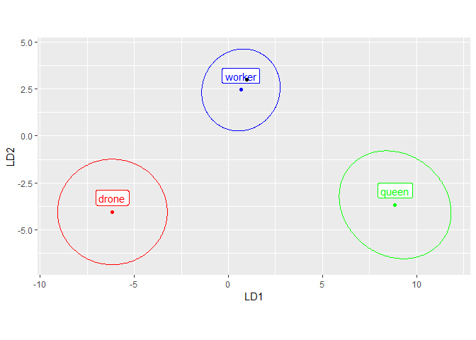

<!-- README.md is generated from README.Rmd. Please edit that file -->

# IdentiFlyR

<!-- badges: start -->
<!-- badges: end -->

IdentiFlyR can be used to save identification data in an XML file. Later
the data can be read from XML file and used for identification of an
unknown sample. An alternative to IdentiFlyR could be providing all raw
data and use them for identification. In case of large datasets this
could be less convenient, slower and undesirable. The identification is
based on linear discriminant analysis (LDA) known also as canonical
variate analysis (CVA).The focus of IdentiFlyR is use of LDA for
identification of an unknown samples and not exploratory analysis. At
the moment IdentiFLyR supports only geometric morphometrics data in two
dimensions. XML files can be used in IdentiFly software where landmarks
can be marked on an image and used for identification.

## Installation

You can install the development version of IdentiFlyR
[GitHub](https://github.com/) with:

``` r
# install.packages("devtools")
devtools::install_github("xxx/IdentiFlyR")
```

## Examples

Read identification data from XML file and plot means and confidence
ellipses in the first two linear discriminant functions. Identification
data consists of: reference, means, covariances and coefficients.
idData$reference numerical vector with x and y coordinates of reference configuration. It is necessary for alignment of unknown data.  idData$means
mean configurations for all classes. They are in the same space as
reference configuration.
idData$covariances - list of covariance matrices for all classes. The covariances are in LDA space. idData$coefficients -
coefficients for transferring data from reference space to LDA space.

``` r
library(IdentiFlyR)
idData = xml2gmLdaData("C:/soft/IdentiFlyPro/dwxml/apis-mellifera-queens-workers-drones.dw.xml")
names(idData)
#> [1] "reference"    "means"        "covariances"  "coefficients"
# transfer means to LDA space
meansLda = idData$means %*% t(idData$coefficients)
covEllipses(meansLda, idData$covariances)
```


Read raw coordinated of 19 landmarks.

``` r
wings <- read.csv("https://zenodo.org/record/8071014/files/IN-raw-coordinates.csv")
wings <- data.frame(wings, row.names = 1)  # move column 1 to row names
head(wings,2)
#>                          x1  y1  x2  y2  x3  y3  x4  y4  x5  y5  x6  y6  x7  y7
#> IN-0001-000243-L.dw.png 195 169 213 166 268 246 261 192 267 108 337 250 386 282
#> IN-0001-000243-R.dw.png 180 251 193 243 272 290 231 242 214 166 333 266 392 272
#>                          x8  y8  x9  y9 x10 y10 x11 y11 x12 y12 x13 y13 x14 y14
#> IN-0001-000243-L.dw.png 369 258 406 224 382 204 422 171 427 131 438  99 451 270
#> IN-0001-000243-R.dw.png 367 258 386 210 357 204 379 156 364 120 361  85 448 236
#>                         x15 y15 x16 y16 x17 y17 x18 y18 x19 y19
#> IN-0001-000243-L.dw.png 479 235 559 194 593 191 601 161  82 244
#> IN-0001-000243-R.dw.png 458 189 512 119 542 101 539  72 104 369
```

Classify mean of all data. Mean of all rows was classified as “worker”.

``` r
id = gmLdaData2id(idData, wings, average = TRUE)
id$plot
```



``` r
id$id
#>               MD2            P
#> drone  73.8759245 8.318471e-18
#> queen  64.6842675 8.791401e-16
#> worker  0.5041501 4.776823e-01
```

Classify rows. All 350 rows were classified as “worker”.

``` r
id = gmLdaData2id(idData, wings, average = FALSE)
id$plot
```


``` r
head(id$id, 2)
#>                          group         P
#> IN-0001-000243-L.dw.png worker 0.5746041
#> IN-0001-000243-R.dw.png worker 0.3949792
table(id$id$group)
#> 
#> worker 
#>    350
```

Classify the first row. It was classified as “worker”.

``` r
id = gmLdaData2id(idData, wings[1,])
id$id
#>               MD2            P
#> drone  69.7285902 6.805252e-17
#> queen  67.5410674 2.063440e-16
#> worker  0.3150395 5.746041e-01
```

Create identification data and save them in XML file.

``` r
wingsLin <- read.csv("https://zenodo.org/record/7567336/files/Nawrocka_et_al2018-sample-aligned.csv")
grVec = wingsLin$lineage
wingsLin = wingsLin[, -c(1:4)] # remove unwanted columns
XML = gmLdaData2xml(wingsLin, grVec)
# add prototype for IdentiFly software
XML$addTag("prototype", close=TRUE, attrs = c(file="apis-worker-prototype.dw.png"))
library(XML) 
XML::saveXML(XML$value(), file="apis-mellifera-lineage.dw.xml",
             prefix = "<?xml version=\"1.0\" encoding=\"UTF-8\"?>\n")
#> [1] "apis-mellifera-lineage.dw.xml"
```
